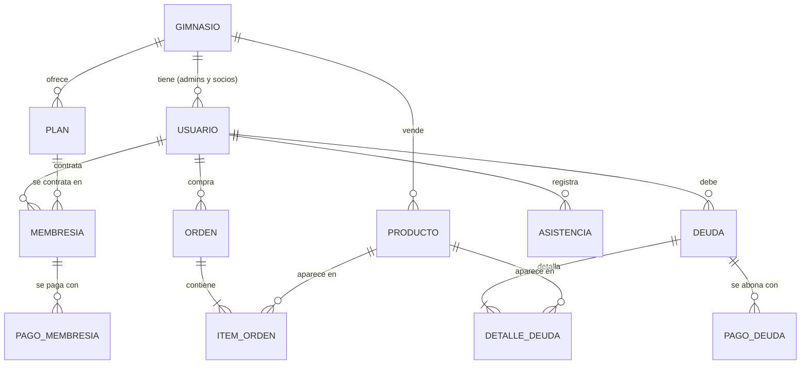

# GymCRM

API REST para administrar gimnasios: socios, planes, membresías y sus pagos, venta de productos, control de asistencia y un dashboard con las métricas del día y del mes.

Cada gimnasio es independiente (multi-tenant): el administrador solo ve y modifica los datos de su propio gimnasio, que se toma del token JWT y nunca del cuerpo de la petición.

## Stack

- Java 21 · Spring Boot 4 (Web MVC, Data JPA, Validation, Security)
- MySQL
- JWT (jjwt) con access token y refresh token
- Lombok · Gradle

## Modelo de datos



| Entidad | Qué representa |
|---|---|
| **Gimnasio** | El tenant. Se crea junto con su administrador en el signup. |
| **Usuario** | Persona del gimnasio. Rol `ADMIN` (con contraseña) o `SOCIO` (accede solo con su correo). |
| **Plan** | Oferta del gimnasio: nombre, precio y duración en días. |
| **Membresía** | Un socio contratando un plan entre `fechaInicio` y `fechaFin`. Si no se envía la fecha de fin, se calcula con la duración del plan. |
| **PagoMembresía** | Abono a una membresía. El estado de la membresía se recalcula con cada pago: `DEUDA` (sin pagos), `PAGO_PARCIAL` o `PAGADO`. |
| **Producto** | Artículo a la venta con precio y stock (con bloqueo optimista para evitar sobreventa). |
| **Orden / ItemOrden** | Compra de productos de un socio. Cada ítem congela el precio unitario, descuenta stock y lleva un estado `PAGADO` o `DEUDA`. |
| **Asistencia** | Registro de entrada de un socio al gimnasio. |
| **Deuda / DetalleDeuda / PagoDeuda** | Modelo de deudas por productos y sus abonos. Por ahora solo existen las entidades, sin endpoints. |

Todas las entidades principales heredan de `AuditableEntity` (fechas de creación y modificación).

## Seguridad

- **Autenticación JWT**: el access token dura 15 min y el refresh token 7 días.
- **Roles**:
  - `/auth/**` es público.
  - `/mi-cuenta/**` es solo para `SOCIO`.
  - Todo lo demás es solo para `ADMIN`.
- **Rate limit** (token bucket en memoria, por instancia):
  - `/auth/**`: 10 peticiones por minuto por IP, contra la fuerza bruta.
  - Resto de la API: 120 peticiones por minuto por usuario.
  - Al superarlo responde `429` con `Retry-After`.
- **Cabeceras de seguridad**: `Content-Security-Policy`, `Referrer-Policy`, `X-Content-Type-Options` y `X-Frame-Options`.
- **Respuestas**: todas usan el mismo envoltorio, `{ "success", "message", "data" }`.

## Endpoints

| Método | Ruta | Rol | Descripción |
|---|---|---|---|
| POST | `/auth/signup` | público | Crea gimnasio y administrador; devuelve tokens y dashboard |
| POST | `/auth/login` | público | Login de administrador; devuelve tokens y dashboard |
| POST | `/auth/socio/acceso` | público | Acceso de socio solo con correo |
| POST | `/auth/refresh` | público | Renueva tokens con el refresh token |
| GET | `/dashboard` | ADMIN | Métricas del gimnasio (ingresos, ventas, socios, membresías, últimas órdenes) |
| CRUD | `/socios` | ADMIN | Gestión de socios |
| CRUD | `/planes` | ADMIN | Gestión de planes |
| CRUD | `/productos` | ADMIN | Gestión de productos |
| CRUD | `/membresias` | ADMIN | Gestión de membresías |
| POST / PUT | `/membresias/{id}/pagos[/{pagoId}]` | ADMIN | Registrar o corregir pagos de una membresía |
| POST / GET | `/ordenes` | ADMIN | Registrar y listar ventas de productos |
| POST / GET | `/asistencias` | ADMIN | Registrar y listar asistencias |
| GET | `/mi-cuenta/membresias` | SOCIO | Membresías del socio autenticado |
| GET | `/mi-cuenta/compras` | SOCIO | Compras del socio autenticado |

Ejemplo de creación de orden:

```json
POST /ordenes
{
  "socioId": 5,
  "items": [
    { "productoId": 12, "cantidad": 2, "estado": "PAGADO" },
    { "productoId": 8,  "cantidad": 1, "estado": "DEUDA" }
  ]
}
```

## Ejecutar en local

Variables de entorno requeridas:

| Variable | Descripción |
|---|---|
| `DB_URL` | p. ej. `jdbc:mysql://localhost:3306/gymcrm` |
| `DB_USERNAME` / `DB_PASSWORD` | Credenciales de MySQL |
| `JWT_SECRET` | Clave Base64 de al menos 256 bits (`openssl rand -base64 32`) |
| `DDL_AUTO` | Opcional, por defecto `update` |
| `RATE_LIMIT_ENABLED` | Opcional, por defecto `true` |

```bash
./gradlew bootRun
./gradlew test
```
